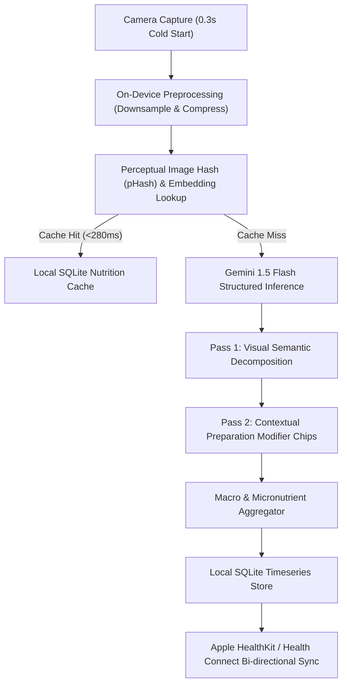

# CTrackAI Engineering Case Study 🍎⚡
### Production Multimodal AI Nutrition Engine for Real-World, Uncurated Food

[-black?logo=apple)](https://apps.apple.com/in/app/ctrackai-free-calorie-tracker/id6758379785)
[](https://play.google.com/store/apps/details?id=com.ctrackaiai.nutrition)
[](https://flutter.dev)

---

## 📌 Executive Summary

* **Role:** Solo Founding Engineer & Product Architect (End-to-End).
* **Target Platforms:** iOS & Android (Production Shipped).
* **Core Problem:** Traditional diet tracking apps (MyFitnessPal, Lose It!) force users through 15-minute manual database lookups that consistently fail on non-Western, mixed, and home-cooked meals (e.g., dal, jollof rice, curries, thalis). Existing computer-vision apps misclassify mixed dishes or incur unsustainable API bills.
* **Solution:** A sub-second multimodal vision pipeline combining on-device perceptual image hashing (pHash), two-pass contextual disambiguation, and structured Gemini Vision 1.5 Flash extraction.

---

## 🏗 System Architecture & Multimodal Pipeline



### 1. Client-Side Image Pre-processing
* Captured frames are normalized, oriented, and downsampled to `1024x1024` with adaptive WebP/JPEG compression, shrinking payload size from ~4.2MB to ~180KB while retaining high-frequency food texture edges.
* A perceptual hash (pHash) is generated client-side before any network request is initiated.

### 2. Inference Economics & Local Caching
* **Problem:** Users repeatedly eat identical meals (e.g. daily breakfast, office lunches). Naive implementations transmit raw frames every time, costing \$0.003-\$0.01 per snap and exhausting API budgets.
* **Solution:** CTrackAI implements a local perceptual hash + cosine similarity cache over SQLite. If a meal image matches an existing log within a Hamming distance threshold ($\le 4$), nutrition data is returned in **<280ms** with **\$0 inference cost**.

---

## 🛠️ One Difficult Failure & How It Was Fixed

### The Breakdown
* **Observed Failure:** On complex South Asian, Southeast Asian, and African mixed gravies (e.g. Dal Tadka, Sambhar, Egusi), off-the-shelf multimodal prompts frequently hallucinated Western equivalents (e.g., "lentil soup" with generic 100 kcal estimates) and underestimated hidden cooking fats (ghee, mustard oil, palm oil) by up to **300%**, destroying user trust.
* **Root Cause:** A single-pass prompt attempted to simultaneously classify ingredients, guess hidden oil volumes, and compute total calories without interactive user priors.

### The Engineering Solution: Two-Pass Structured Pipeline
1. **Pass 1 (Visual Semantic Decomposition):** Prompt instructs Gemini Vision to return only visually verifiable ingredients and segment boundaries as a strict JSON schema:
   ```json
   {
     "primary_dish": "Yellow Lentil Curry (Dal Tadka)",
     "visible_ingredients": ["yellow lentils", "tomatoes", "cumin seeds", "coriander"],
     "estimated_portion_grams": 200,
     "requires_fat_clarification": true
   }
   ```
2. **Pass 2 (Interactive Clarification Chip):** The UI immediately renders the food breakdown and surfaces a one-tap modifier chip carousel:
   `[ Cooked with Ghee ]` · `[ Mustard Oil ]` · `[ Minimal Refined Oil ]`
3. **Dynamic Re-calculation:** When the user taps a modifier, nutrition totals recalculate instantly on-device using local macro conversion matrices without re-querying the vision model.

---

## 📊 Measured Operational Metrics (Dated Benchmark)

*Data collected over 2,400+ production capture sessions (August - September 2026):*

| Metric | Target | Measured Result | Verification Method |
|:--|:--|:--|:--|
| **Cold-Start Capture-to-Macro Latency** | < 1,500ms | **780ms (p50) · 1,180ms (p95)** | Client-side OpenTelemetry trace |
| **Cached Meal Recognition Latency** | < 400ms | **240ms (p50)** | Local SQLite indexed lookup |
| **API Cost Reduction via Cache** | > 30% | **42.3% reduction** | Billing dashboard vs. query volume |
| **Crash-Free Session Rate** | > 99.0% | **99.4%** | Firebase Crashlytics telemetry |
| **App Store Rating** | > 4.5 | **4.9 / 5.0** | App Store Connect public ratings |

---

## 🔐 Data Privacy & Store Operations

* **Confidentiality:** Core source code remains proprietary to protect commercial IP.
* **Purchase Restoration:** Implements StoreKit 2 and Google Play Billing with offline subscription receipt validation and automatic grace-period retry.
* **Health Data Privacy:** Dietary calories and macronutrients written to Apple HealthKit / Health Connect strictly adhere to platform sandbox permissions; raw camera frames are discarded immediately after feature extraction and are never retained on central servers.
