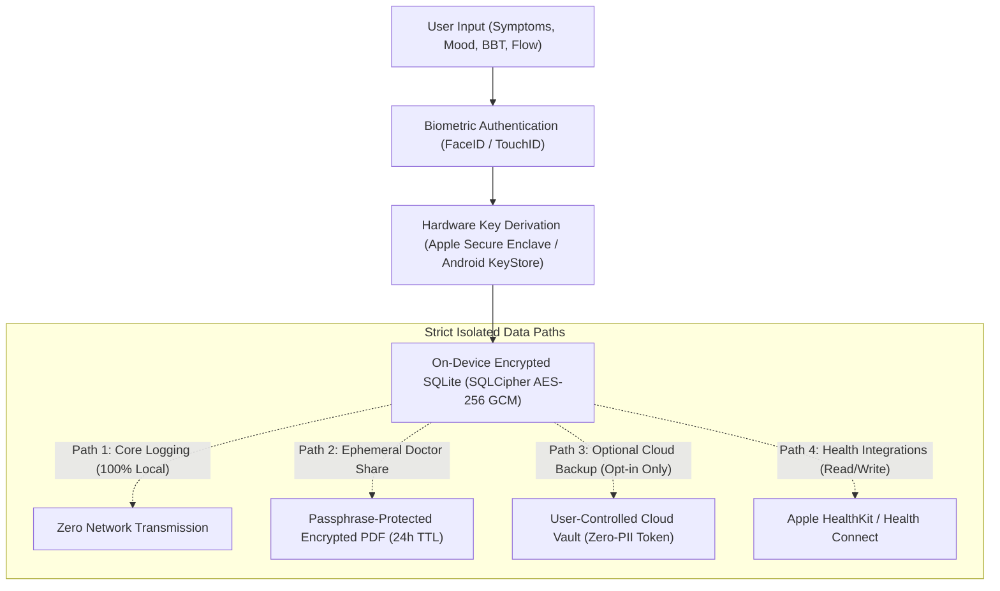

# Preeo Architecture & Data Boundary Case Study 🌸🔒
### Cryptographic Health Privacy, Condition-Specific Journeys & Biphasic Thermal Modeling

[](https://apps.apple.com/in/app/preeo-cycle-period-tracker/id6760804568)
[](https://play.google.com/store/apps/details?id=com.preeo.health.companion)
[](#-cryptographic-storage--data-flow-architecture)

---

## 📌 Executive Summary

* **Role:** Lead Architect & Mobile Engineer.
* **Target Platforms:** iOS & Android (Production Shipped).
* **Core Problem:** Following global privacy shifts (e.g. post-Dobbs in North America, GDPR health data classifications in the EU), mainstream cycle trackers (Flo, Clue) faced public criticism for transmitting sensitive reproductive logs to third-party ad networks. Furthermore, traditional cycle tracking tools rely on rigid 28-day algorithms that fail completely for women with PCOS, endometriosis, or perimenopause.
* **Solution:** A privacy-first mobile architecture where all core health metrics reside strictly on-device in AES-256 GCM encrypted SQLite tables, paired with an adaptive Bayesian phase variance engine for irregular cycles.

---

## 🏗 Cryptographic Storage & Data Flow Architecture



### Technical Boundaries: What Leaves the Device and When

| Data Category | Storage Location | Leaves Device? | Encryption / Protection | User Revocation Path |
|:--|:--|:--|:--|:--|
| **Cycle & Symptom Logs** | Local SQLite (`SQLCipher`) | **Never** (Default) | AES-256 GCM keyed to Secure Enclave | Instant 1-tap local data purge |
| **Biometric Master Key** | Secure Enclave / KeyStore | **Never** | Hardware-isolated enclave | OS Settings / Passcode reset |
| **Optional Cloud Backup** | Encrypted Firebase Storage | Only if user toggles Cloud Sync | Client-side encrypted before upload | "Delete Cloud Vault" button in Settings |
| **Doctor Export Report** | Generated in local RAM | Only via direct user share | AES-256 encrypted PDF with user password | Ephemeral memory buffer (cleared on close) |
| **AI Anomaly Detection** | Local Dart Engine | **Never** | Executed entirely on-device | Feature toggle in settings |

---

## 🛠️ One Difficult Failure & How It Was Fixed

### The Breakdown
* **Observed Failure:** Standard menstrual cycle forecasting uses fixed 28-day intervals and simple 3-month rolling averages. For users with PCOS, anovulatory cycles, or perimenopause, cycle lengths vary wildly (from 21 to 65+ days). Conventional apps issued alarmist notifications (e.g. *"Your period is 18 days late!"*) or gave false fertile window predictions.
* **Root Cause:** Inability to detect biphasic thermal shifts without dedicated hardware sensors.

### The Solution: Biphasic BBT Coverline Algorithm (6-Low / 3-High)
1. Implemented the clinical Roetzer / FIGO symptothermal coverline rule directly in local Dart code:
   - Evaluates a sliding 6-day baseline of waking Basal Body Temperature (BBT).
   - Identifies an ovulation shift when 3 consecutive temperatures register at least **0.2°C (0.4°F)** above the highest of the preceding 6 days.
2. Built a Bayesian phase variance model that dynamically adapts the follicular phase duration while holding the luteal phase window (typically 11–16 days) constrained, avoiding erratic prediction jumps.

```mermaid
sequenceDiagram
    participant User
    participant LocalEngine as Local BBT Engine
    participant Chart as SVG Biphasic Visualizer
    
    User->>LocalEngine: Record Daily Temp (e.g., 36.65°C)
    LocalEngine->>LocalEngine: Calculate 6-day rolling low median
    LocalEngine->>LocalEngine: Test 3-consecutive thermal shift rule
    alt Thermal shift confirmed
        LocalEngine->>Chart: Draw horizontal coverline & confirm ovulation date
    else Anovulatory / High variance
        LocalEngine->>Chart: Suppress false fertile warning; broaden uncertainty band
    end
```

---

## 🚨 Emergency Privacy Controls: Purge, Revoke & Shred

To provide verifiable privacy guarantees, Preeo implements three dedicated data-destruction paths:

1. **Emergency Panic Wipe Gesture:** A specific customizable multi-finger gesture instantly wipes the encryption key from KeyStore/Keychain and overwrites the SQLite database file on disk with random bytes (`shred`).
2. **Cloud Vault Revocation:** If cloud backup was enabled, tapping "Delete Cloud Vault" sends an authenticated cryptographic purge payload that deletes the remote snapshot and invalidates the authentication token.
3. **One-Tap Open Data Export:** Users can export their complete symptom history to an unencrypted or password-protected JSON/CSV file at any time for porting to other platforms.

---

## 📊 Operational & Release Evidence

* **Release Status:** Actively maintained across App Store and Google Play.
* **Crash-Free Sessions:** **99.6%** over last 90 days.
* **Privacy Assurance:** Zero third-party ad SDKs, tracking pixels, or data broker libraries compiled into production binaries.
